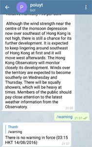
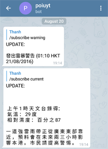

# Telegram Bot HK Weather

[](https://travis-ci.org/trinhtt/telegramBot)

This is a Telegram Bot which gives you the current weather and warning informations about Hong Kong weather based on a RSS Feed (https://data.gov.hk/en-data/provider/hk-hko).





## Installation

1. A bot token is needed, to obtain one, talk to @botfather and create a new bot
2. In `index.js` at line 8, insert your bot token
3. You need a running MongoDB server on localhost. Install the MongoDB client and boot the server with the command:
```sh
$ mongod --dbpath=/data --port 27017
```
4. Run `index.js` and the bot will listen for inputs


## Usage

Available commands:

- \help: Displays all the available commands
- \current: Displays the current weather
- \warning: Displays weather warning
- \language: Displays the language you will receive the results
- \subscribe (current|warning): Subscribe to current or warning feed. When there is something new, you will receive a notification
- \unsubscribe (current|warning): To unsubscribe to a feed. You won't receive notifications anymore.
- \topics: Topics that you can query the bot
- \\(english)(simplified)(traditional): Change the language you will receive the results


## Debug Mode

 When you subscribe to a topic, it may take a long time before the RSS Feed updates, so you may want to test it in a different way. In `weatherServices.js`, set `debugmode` to `true` to stop polling the RSS for updates, and use a local file located at `./debug`. Change manually the `pubDate` in the file, and you will receive a notification.

## License
